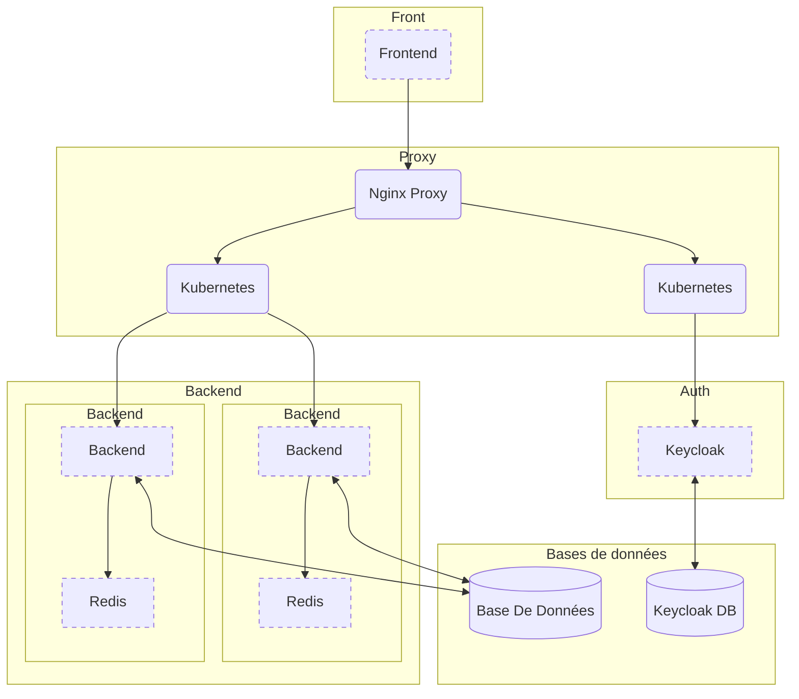

# JO_Temp

# JO_Front

JO_Front is a React front-end application for the Olympic Games 2024 ticketry.

## Description

This application serves as the front page for the Olympic 2024 ticketry system. It provides users with an intuitive and user-friendly interface to browse and purchase tickets for various Olympic days.

## Features

- Get a quick view of events
- Get Tickets for yourself, a duo, family and eventually more
- Add tickets to the cart and proceed to checkout
- User Authentication included

## Installation

1. Clone the repository:

    ```bash
    git clone https://github.com/Zed-964/JO_Front_Temp.git
    ```

2. Install the dependencies:

    ```bash
    npm install
    ```

## Usage

1. Start the development server:

    ```bash
    npm run dev
    ```

2. Open your browser and navigate to [http://localhost:5173](http://localhost:5173).

## Graph for the whole project


## Modified Graph to be confirmed



## Contributing

Contributions are closed for now.

## License

This project is licensed under the MIT License. See the [LICENSE](LICENSE) file for more information when it pops up.
